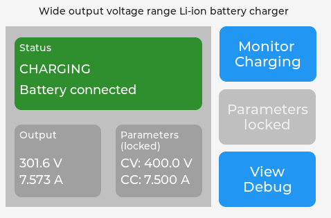
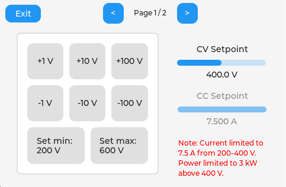
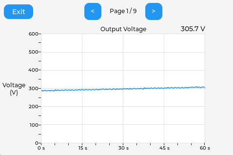
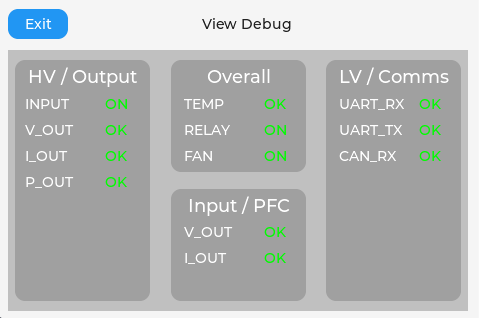
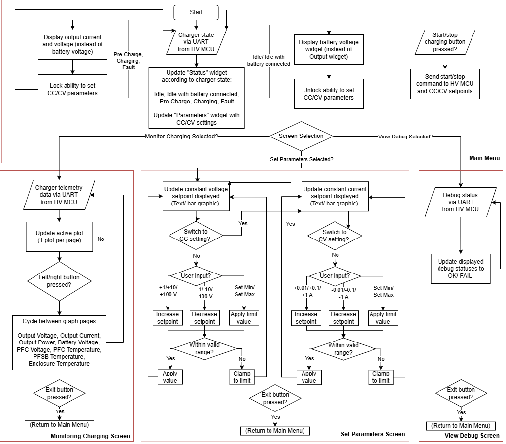
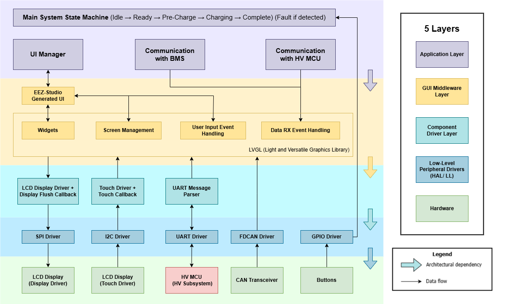

# EZEV Charger LV/ Human-Machine Interface (HMI)

## Overview

This project is a touchscreen Human-Machine Interface (HMI) for a wide voltage range Li-ion battery charger designed for Formula Student.

The system runs on an STM32G474RE and provides:

* Real-time charger monitoring
* Touchscreen parameter configuration
* Live telemetry plotting
* Charger state visualization
* CAN communication with a Battery Management System (BMS)
* UART communication with the charger power stage (HV MCU) to fetch telemetry and send commands/setpoints
* Fault monitoring and diagnostics

The user interface is implemented using LVGL and designed in EEZ Studio.

---

## User Interface

### Main Screen



Features:

* Charger status
* Live voltage/current display
* CV and CC setpoints
* Quick system overview

---

### Parameter Configuration



Features:

* Constant Voltage adjustment
* Constant Current adjustment
* Safety limits

---

### Telemetry Charts



Features:

* Live data plotting
* Historical trend viewing
* Multiple telemetry channels

---

### Debug Screen



Features:

* Communication health monitoring
* Fault reporting
* Internal system status

---

## User Flow Block Diagram



---

## Features

### Touchscreen User Interface

* 480 × 320 TFT LCD display
* Capacitive touch input (GT911)
* Multi-page graphical interface
* Real-time status updates

### Charger Monitoring

Displays:

* Output Voltage
* Output Current
* Output Power
* Battery Voltage
* PFC Voltage
* Temperature Sensor 1
* Temperature Sensor 2
* Temperature Sensor 3

### Live Telemetry Charts

The system continuously plots:

* Output voltage
* Output current
* Output power
* Battery voltage
* PFC voltage
* Temperature sensors

Historical telemetry is displayed using scrolling LVGL charts.

### Charger State Machine

Supported states:

| State                       | Description                            |
| --------------------------- | -------------------------------------- |
| IDLE (Battery Disconnected) | Charger waiting for battery connection |
| IDLE (Battery Connected)    | Battery detected, ready to start       |
| PRE-CHARGE                  | Precharge sequence active              |
| CHARGING                    | Active charging                        |
| SHUTDOWN                    | Controlled shutdown                    |
| FAULT                       | Charger fault state                    |

### CAN Communication

Receives:

* Constant voltage setpoint
* Constant current setpoint
  * CC/CV settings can also be configured using the GUI.
* BMS fault status

The charger HMI automatically updates:

* Constant Voltage (CV) target
* Constant Current (CC) target
* Fault indication

### UART Communication

Receives charger telemetry from the power stage.

Example telemetry:

```text
VI:230.50, VO:54.30, IO:12.345, VB:48.20,
PO:654.32, T1:25.10, T2:26.20, T3:27.30,
ST:3, ER:00
```

The HMI parses incoming data and updates all UI elements in real time.
The telemetry data is also shared via CAN for external debugging.

### Fault Monitoring

Monitored faults include:

* Input undervoltage
* Input overvoltage
* Battery reverse polarity
* Battery overvoltage
* Output overcurrent
* Output overvoltage
* Output overpower
* Overtemperature
* UART RX timeout
* CAN RX timeout

Fault conditions are highlighted directly within the UI.

---

## Hardware

### MCU

* STM32G474RE

### Display

* ILI9488 TFT LCD
* 480 × 320 resolution
* SPI interface with DMA acceleration

### Touch Controller

* GT911
* I2C interface

### Communications

* UART
* CAN

---

## Software Architecture



---

## CAN Protocol

### Receive CC/CV setpoint

Extended ID:

```text
0x00FFFFFF
```

Payload format:

| Byte | Description          |
| ---- | -------------------- |
| 0-2  | Voltage setpoint (BCD) |
| 3-5  | Current setpoint (BCD) |
| 6-7  | RESERVED               |

Example:

```text
48 27 35 68 12 34 00 00
```

Decodes to:

```text
Voltage = 482.735 V
Current = 6.81234 A
Error Code = 0x0000
```

### Status message stream

Extended ID:

```text
0x001FFFFF
```

Payload format:

| Byte | Description          |
| ---- | -------------------- |
| 0-2  | Charger status code    |
| 3-7  | RESERVED               |

Example:

```text
AA 00 00 00 00 00 00 00
```

Decodes to:

```text
AMS fault
```
---

## UART Commands to HV MCU

### Set Voltage

```text
\V xxx
```

Example:

```text
\V 400
```

---

### Set Current

```text
\C x.xx
```

Example:

```text
\C 6.50
```

---

### Start / Stop Charger

```text
\S
```

---

### Fault Command

```text
\F 1
```

Fault active

```text
\F 0
```

Fault cleared

---

## Future Improvements

* Data logging
* Charge session history
* Firmware update capability
* Remote monitoring interface
* Additional fault diagnostics

---

## Author

Chun Hei Wong

4th Year Team Project

The University of Manchester

2026
